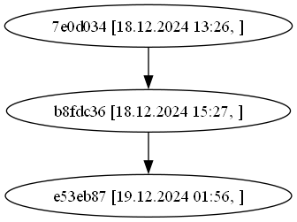

# Git Dependency Visualizer

## Описание проекта

Этот инструмент командной строки предназначен для визуализации графа зависимостей в Git-репозитории, включая транзитивные зависимости. Граф строится для коммитов, в которых фигурирует заданный файл, и отображает информацию о каждом коммите, такую как дата, время и сообщение.

Визуализация осуществляется с помощью Graphviz, и результат выводится в виде кода DOT, который можно затем визуализировать в графическом виде.

## Основные функции

- **Загрузка конфигурации**: Загрузка пути к репозиторию, файлу и инструменту для визуализации из конфигурационного файла JSON.
- **Извлечение данных о коммитах**: Получение данных о коммитах с использованием Git (например, автор, дата, родительские коммиты).
- **Построение графа зависимостей**: Строится граф зависимостей для всех коммитов, в которых присутствует указанный файл.
- **Генерация кода для Graphviz**: Генерация кода DOT для визуализации графа зависимостей.
- **Визуализация графа**: Визуализация графа с помощью Graphviz.

## Установка

1. Клонируйте репозиторий:
   ```bash
   git clone git@github.com:Dpanov2302/kisscm-2.git
   cd kisscm-2
   ```

2. Убедитесь, что у вас установлен Python 3 и все необходимые библиотеки:
   ```bash
   pip install -r requirements.txt
   ```

3. Установите Graphviz (если еще не установлен). Для визуализации графа потребуется установить Graphviz:
   - Для Windows: скачайте и установите Graphviz с [официального сайта](https://graphviz.gitlab.io/download/).
   - Для Linux/MacOS:
     ```bash
     sudo apt-get install graphviz  # Ubuntu/Debian
     brew install graphviz  # MacOS (с использованием Homebrew)
     ```

## Конфигурационный файл

Пример конфигурации `config.json`:

```json
{
  "repository_path": "path/to/your/repo",
  "file_name": "name-of-your-file",
  "graph_visualizer_path": "path/to/your/Graphviz/bin/dot.exe",
  "output_file": "graph.dot"
}
```

### Описание полей:

- `repository_path`: Путь к Git-репозиторию, в котором будет строиться граф зависимостей.
- `file_name`: Имя файла в репозитории, для которого необходимо построить граф зависимостей.
- `graph_visualizer_path`: Путь к инструменту Graphviz, который будет использоваться для визуализации (например, путь к \`dot.exe\`).
- `output_file`: Путь для сохранения сгенерированного файла с кодом DOT для графа зависимостей.

## Как использовать

1. Создайте и настройте файл конфигурации `config.json` в корне репозитория.
2. Запустите скрипт:

   ```bash
   python main.py ./config.json
   ```

3. В результате будет сгенерирован код DOT для графа зависимостей. Он будет выведен на экран и сохранен в указанный файл.

4. Для визуализации графа выполните следующую команду с помощью Graphviz:

   ```bash
   dot -Tpng graph.dot -o graph.png
   ```

   Эта команда сгенерирует граф в формате PNG на основе кода DOT.

## Пример сгенерированного графа

1. Содержимое файла `graph.dot` в результате выполнения первого скрипта:

   ```dot
   digraph G {
       "e53eb8730545aefaca86092d9403a01d46cd29c9" [label="e53eb87 [19.12.2024 01:56, ]"];
       "b8fdc367e8183be76ae164799d3b580fe9c8cf18" -> "e53eb8730545aefaca86092d9403a01d46cd29c9";
       "b8fdc367e8183be76ae164799d3b580fe9c8cf18" [label="b8fdc36 [18.12.2024 15:27, ]"];
       "7e0d034fbb2987d99ab9d942bcd3b0e0415ff1b0" -> "b8fdc367e8183be76ae164799d3b580fe9c8cf18";
       "7e0d034fbb2987d99ab9d942bcd3b0e0415ff1b0" [label="7e0d034 [18.12.2024 13:26, ]"];
   }
   ```

2. Визуализированный граф в файле `graph.png` в результате выполнения второго скрипта:

      

## Тестирование

Весь функционал визуализатора покрыт тестами. Для запуска тестов используйте:

```bash
python -m unittest discover -s tests
```

Тесты проверяют корректность работы всех основных функций, включая загрузку конфигурации, получение данных о коммитах, построение графа зависимостей и генерацию кода DOT.

## Результаты прогона тестов

Для проекта написаны тесты, покрывающие все функции эмулятора. Все тесты можно запустить с помощью команды `python -m unittest discover -s tests`. Пример вывода тестов:

```bash
Ran 4 tests in 0.016s

OK
```

## Зависимости

- Python 3.x
- Graphviz (для визуализации)
- Библиотека `json` (встроенная)
- Библиотека `zlib` (встроенная)
